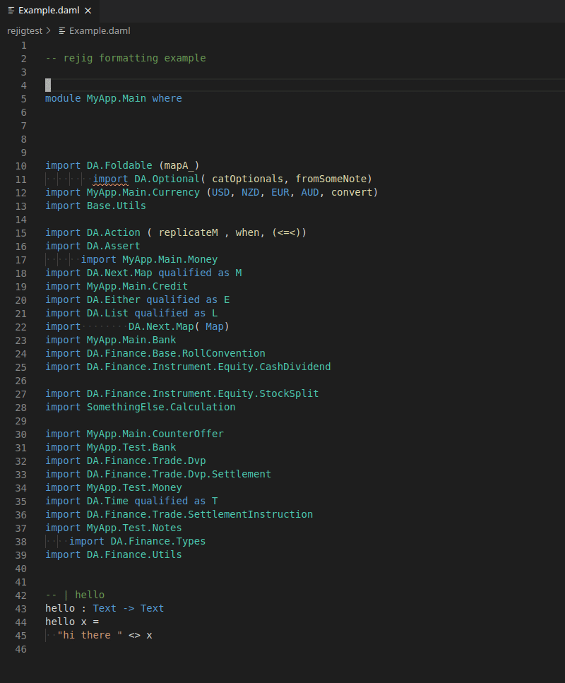

# rejig-vscode-extension

VS Code extension for the [rejig](https://github.com/mjstewart/rejig) Haskell/DAML module header formatting tool.

A command is registered and made available within `haskell` and `daml` files.

1. invoke the command pallete `ctrl+shift+p`
2. `>Rejig Document`



## Requirements

`rejig` must be available on `$PATH`. See [rejig](https://github.com/mjstewart/rejig) for assistance.

## Install

Available in the marketplace

https://marketplace.visualstudio.com/items?itemName=MattStewart.rejig-vscode-extension

## Extension Settings

This extension contributes most of the [rejig flags](https://github.com/mjstewart/rejig#args).

Here's an example `settings.json` keeping in mind that `rejig.prefixGroups` are application specific.

```
  "rejig.prefixGroups": [
    "DA"
  , "DA.Next"
  , "DA.Finance"
  , "Daml"
  , "MyApp.Test"
  , "MyApp.Main"
  ],
  "rejig.displayImportGroupTitles": true,
  "rejig.displayImportBorderTop": true,
  "rejig.displayImportBorderBottom": true,
  "rejig.writeErrorFile": true
```

* `rejig.prefixGroups`: The most specific prefixes must be listed last
* `rejig.writeErrorFile`: within the workspace root directory, errors are written to `rejig-error.txt`. It's recommended to add this file to `.gitignore`.

## Known Issues

Please create a github issue

## Release Notes

See [CHANGELOG.md](https://github.com/mjstewart/rejig-vscode-extension/blob/master/CHANGELOG.md)
